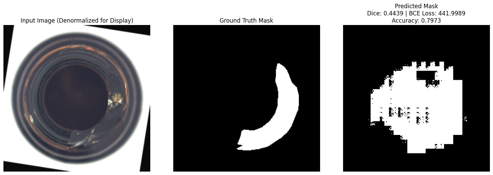
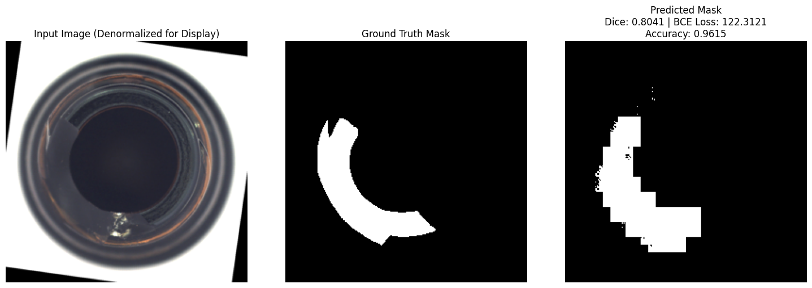
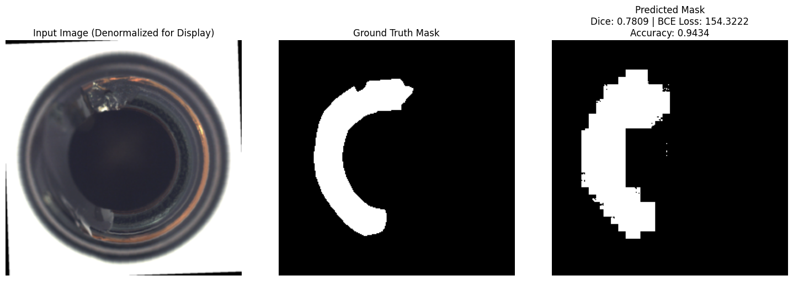
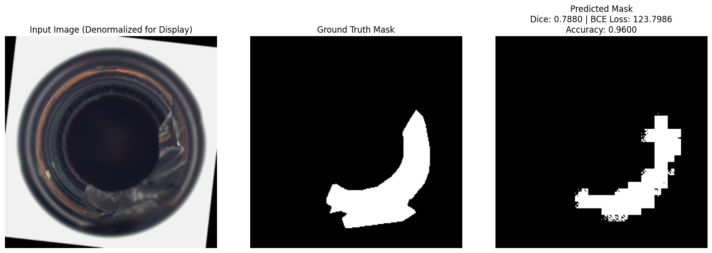
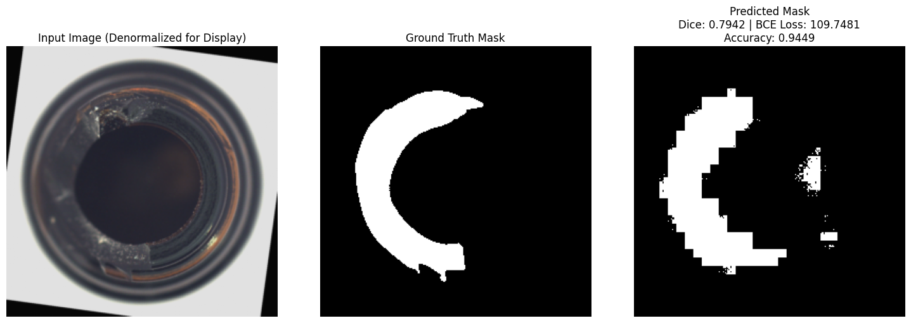

# Laporan UAS Deep Learning

**Nama:** Muhammad Ikhwan Fathulloh
**NIM:** 242011017

---

# Judul

**Deteksi Anomali Otomatis pada Botol Menggunakan Deep Learning dengan Dataset MVTec AD Bottle**

---

# 1. Latar Belakang

Dalam industri manufaktur, proses Quality Control (QC) merupakan bagian penting untuk memastikan produk yang dihasilkan sesuai dengan standar kualitas. Pemeriksaan manual seringkali tidak efisien dan berpotensi menghasilkan kesalahan, terutama jika volume produksi sangat besar.

Dengan perkembangan teknologi Deep Learning (DL), proses inspeksi visual dapat diotomatisasi menggunakan model yang mampu mendeteksi dan mengklasifikasikan produk cacat secara akurat dan konsisten. Salah satu contoh penerapannya adalah deteksi anomali pada produk botol, yang menjadi fokus penelitian ini.

---

# 2. Tujuan

* Membangun sistem otomatis untuk deteksi anomali pada botol berbasis Deep Learning.
* Meningkatkan efisiensi dan akurasi dalam inspeksi produk industri.
* Melatih dan menguji model segmentasi untuk mengidentifikasi jenis cacat pada botol.

---

# 3. Dataset

Dataset yang digunakan adalah **MVTec Anomaly Detection (MVTec AD) - Bottle Class**.

## Struktur Dataset:

* **Training Data:** Berisi gambar botol yang tidak cacat (label: good).
* **Testing Data:** Berisi gambar botol normal dan botol cacat, dengan variasi cacat seperti:

  * **broken\_large:** Botol pecah besar
  * **broken\_small:** Botol pecah kecil
  * **contamination:** Botol dengan kontaminasi

## Ground Truth:

Dataset juga menyediakan mask ground truth yang menunjukkan area cacat pada gambar botol, digunakan untuk evaluasi segmentasi.

---

# 4. Metodologi

## 4.1 Preprocessing Data

* Resize gambar menjadi ukuran seragam.
* Normalisasi gambar menggunakan statistik ImageNet.
* Denormalisasi saat evaluasi untuk visualisasi yang realistis.

## 4.2 Custom Dataset (PyTorch)

Dataset didefinisikan menggunakan class `AnomalyDataset` yang memuat gambar dan mask secara sinkron dengan transformasi bersama. Mask dikonversi ke biner untuk segmentasi.

## 4.3 Data Augmentation

* **Transformasi Sinkron:** Horizontal flip, vertical flip, dan rotasi dilakukan pada gambar dan mask secara bersamaan.
* **Transformasi Gambar:** Resize, jitter warna, konversi tensor, dan normalisasi.
* **Transformasi Mask:** Resize dan konversi tensor.

## 4.4 Arsitektur Model

Model yang digunakan adalah **U-Net dengan Residual Connections**:

* **Downsampling:** Ekstraksi fitur dari gambar.
* **Bottleneck:** Lapisan tengah dengan dropout.
* **Upsampling:** Mengembalikan resolusi gambar dan menggabungkan fitur penting dari encoder.
* **Output:** Segmentasi mask dengan resolusi penuh.

## 4.5 Proses Training

* **Loss Function:** Gabungan Focal Tversky Loss dan Dice Loss.
* **Optimizer:** AdamW dengan weight decay.
* **Learning Rate Scheduler:** Cosine Annealing Warm Restarts.
* **Gradient Accumulation:** Memungkinkan batch besar dengan memori GPU terbatas.
* **Automatic Mixed Precision:** Mempercepat proses training.

## 4.6 Early Stopping

Training dihentikan otomatis jika tidak ada peningkatan Dice Score pada validation set dalam 30 epoch berturut-turut.

## 4.7 Evaluasi dan Visualisasi

* Menggunakan Dice Score dan akurasi pixel-wise serta sample-wise.
* Menampilkan visualisasi input, ground truth, dan predicted mask.

---

# 5. Hasil dan Analisis

## 5.1 Ringkasan Training

| Deskripsi                   | Nilai                  |
| --------------------------- | ---------------------- |
| Best Validation Dice Score  | 0.8127 (epoch 69)      |
| Final Validation Dice Score | 0.7893 (epoch 99)      |
| Early Stopping              | Aktif setelah 99 epoch |

## 5.2 Hasil Evaluasi pada Data Uji

| No  | Gambar  | Raw Tensor Range     | Denormalized Range  | Accuracy | Gambar Hasil     |
|-----|---------|----------------------|---------------------|----------|------------------|
| 1   | Image 1 | [-1.9295 .. 2.6400]  | [0.0431 .. 1.0000]  | 79.73%   | AutoQC_Image1    |
|     |         |                      |                     |          |  |
| 2   | Image 2 | [-2.1179 .. 2.6400]  | [0.0000 .. 1.0000]  | 96.15%   | AutoQC_Image2    |
|     |         |                      |                     |          |  |
| 3   | Image 3 | [-2.0665 .. 2.6400]  | [0.0118 .. 1.0000]  | 94.34%   | AutoQC_Image3    |
|     |         |                      |                     |          |  |
| 4   | Image 4 | [-2.1179 .. 2.3960]  | [0.0000 .. 0.9451]  | 96.00%   | AutoQC_Image4    |
|     |         |                      |                     |          |  |
| 5   | Image 5 | [-1.9980 .. 2.1171]  | [0.0275 .. 0.8824]  | 94.49%   | AutoQC_Image5    |
|     |         |                      |                     |          |  |

### Rata-rata Akurasi:

Rumus rata-rata akurasi:

$$
\text{Akurasi Rata-rata} = \frac{\sum_{i=1}^{n} \text{Akurasi}_i}{n}
$$

Perhitungan:

$$
\text{Akurasi Rata-rata} = \frac{79.73 + 96.15 + 94.34 + 96.00 + 94.49}{5} = 92.14\%
$$

### Analisis:

* Model mampu mendeteksi cacat besar dan kecil dengan akurasi yang tinggi.
* Performa terendah terjadi pada gambar dengan cacat kecil yang sulit terdeteksi.

## 5.3 Visualisasi Hasil

Model berhasil menampilkan segmentasi area cacat yang presisi pada gambar uji, dengan akurasi yang selaras dengan ground truth.

---

# 6. Penjelasan Kode Utama

## 6.1 Custom Dataset

* Membuat class `AnomalyDataset` yang memuat gambar dan mask secara sinkron.
* Mask dikonversi menjadi tensor biner untuk segmentasi.

## 6.2 Data Augmentation

* Sinkronisasi transformasi pada gambar dan mask agar tetap selaras.
* Melakukan augmentasi seperti flip, rotasi, resize, jitter warna, dan normalisasi.

## 6.3 Model U-Net

* Encoder (downsampling) untuk ekstraksi fitur.
* Bottleneck (lapisan tengah) untuk memperdalam pemahaman fitur.
* Decoder (upsampling) untuk mengembalikan ukuran gambar dengan skip connection.
* Residual connection digunakan untuk memperkuat stabilitas model.

## 6.4 Proses Training

* Loss function: Gabungan Focal Tversky Loss dan Dice Loss.
* Gradient Accumulation digunakan untuk efisiensi memori.
* Learning rate disesuaikan dengan Cosine Annealing Scheduler.

## 6.5 Early Stopping

* Training dihentikan jika performa validasi tidak meningkat selama 30 epoch.

## 6.6 Evaluasi dan Visualisasi

* Menghitung dice score dan akurasi pada setiap gambar.
* Visualisasi input image, ground truth mask, dan predicted mask untuk evaluasi kualitatif.

---

# 7. Kesimpulan

* Model Deep Learning berbasis U-Net berhasil diterapkan untuk deteksi anomali pada botol.
* Sistem ini mampu mendeteksi berbagai jenis cacat dengan akurasi rata-rata 92.14%.
* Early stopping efektif dalam mencegah overfitting dan mempercepat waktu training.
* Visualisasi hasil menunjukkan segmentasi cacat yang baik, bahkan pada variasi ukuran cacat.

---

# 8. Rekomendasi

* Melakukan augmentasi tambahan untuk meningkatkan generalisasi model.
* Menggunakan arsitektur yang lebih kompleks seperti Attention U-Net untuk akurasi yang lebih tinggi.
* Menguji model pada dataset real-time di lingkungan produksi.

---

# 9. Referensi

* Dataset: [Kaggle - MVTec Anomaly Detection Dataset](https://www.kaggle.com/datasets/ipythonx/mvtec-ad?resource=download-directory&select=bottle)
* Kode sumber: [GitHub - Capstone Deep Learning with CNN](https://github.com/Muhammad-Ikhwan-Fathulloh/Capstone-Deep-Learning-with-CNN)
